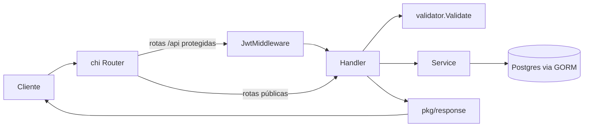
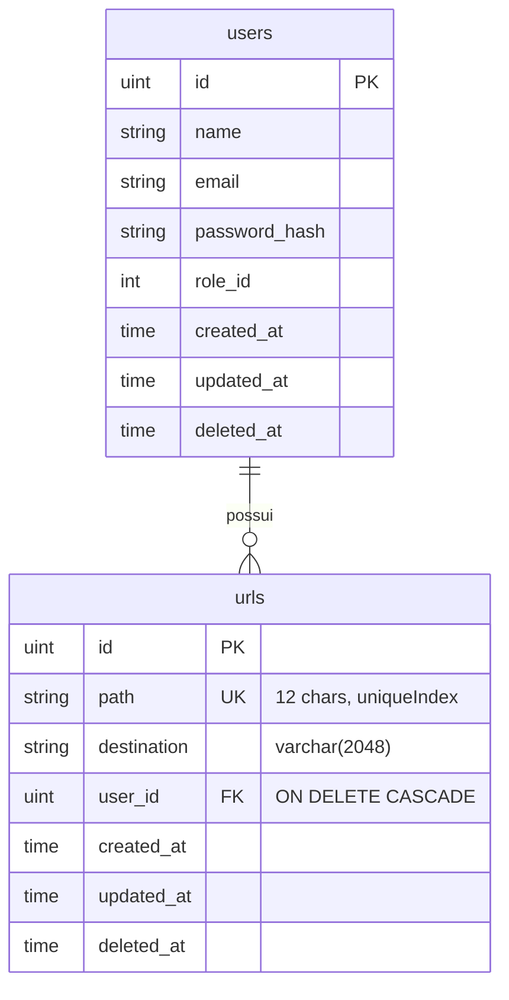
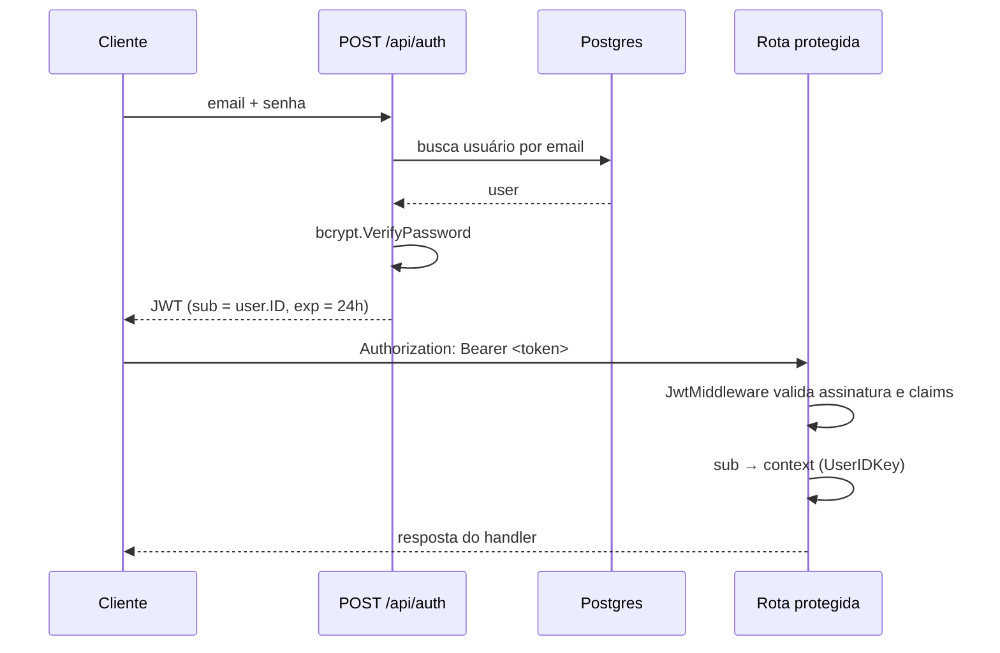

# Design Doc — URL Shortener

**Status:** em desenvolvimento
**Última atualização:** 2026-07-26
**Autor:** mjr

---

## 1. Visão geral

API HTTP em Go para encurtamento de URLs. Um usuário autenticado cadastra uma URL de destino e recebe de volta um código curto; qualquer pessoa que acessar `GET /u/{código}` é redirecionada para o destino original.

O projeto é a base de um serviço multiusuário — cada URL pertence a um usuário — com autenticação por JWT e persistência em Postgres.

### Objetivos

- Encurtar URLs e redirecionar visitantes com latência baixa.
- Isolar URLs por usuário: cada um gerencia apenas o que criou.
- Manter o código simples e direto, sem camadas de abstração desnecessárias para o tamanho atual do projeto.
- Ser deployável como container único (imagem estática Alpine, sem dependências de runtime).

### Fora de escopo (por enquanto)

- Analytics de cliques (contagem, referrer, geolocalização).
- Códigos customizados escolhidos pelo usuário (`/u/meu-link`).
- Expiração de links e URLs protegidas por senha.
- Interface web — o produto é uma API.

---

## 2. Arquitetura

### Stack

| Camada | Escolha | Motivo |
|---|---|---|
| Linguagem | Go 1.25 | binário único, baixo consumo, deploy simples |
| Roteador | chi v5 | leve, compatível com `net/http`, middlewares componíveis |
| ORM | GORM + driver pgx | produtividade em CRUD, soft delete e migrations integradas |
| Banco | Postgres 17 | integridade referencial e índice único no código curto |
| Cache | Redis 7.4 | conectado no boot; **ainda não usado** (ver §8) |
| Auth | JWT HS256 (`golang-jwt/v5`) | stateless, sem sessão em servidor |
| Migrations | gormigrate v2 | versionamento com rollback sobre os models do GORM |
| Validação | go-playground/validator v10 | validação declarativa por struct tag |

### Estrutura de pastas

```
cmd/
  api/        entrypoint HTTP
  migrate/    CLI de migrations (com flag -rollback)
internal/
  config/     singletons de Postgres e Redis
  router/     definição de rotas
  handler/    handlers HTTP + DTOs (request/, response/)
  service/    regra de negócio e acesso a dados
  middleware/ JWT (geração + verificação)
  model/      structs GORM
  repository/ vazio — reservado para extração futura
pkg/
  response/   helpers de resposta JSON
  validator/  decode + validate genérico
  bcrypt/     hash e verificação de senha
migrations/   uma migration por arquivo, auto-registradas
```

O módulo Go se chama `github.com/mjrdev`, e não o nome do repositório — por isso os imports internos ficam `github.com/mjrdev/internal/service`.

### Fluxo de requisição



Responsabilidade de cada camada:

- **Handler** — traduz HTTP: decodifica o corpo, extrai o usuário do contexto, mapeia erro de domínio para status code. Não conhece o banco (exceto `Authenticate`, ver §8).
- **Service** — funções de pacote que chamam `config.Db()` diretamente. Aqui mora a regra de negócio (geração de código, normalização de destino) e as queries.
- **Model** — structs GORM que também definem o schema, já que as migrations usam `AutoMigrate` sobre eles.

### Decisões arquiteturais

**Singletons em vez de injeção de dependência.** `config.Db()` e `config.Rdb()` são globais protegidos por `sync.Once`. Nenhum `*gorm.DB` é passado por parâmetro. Isso deixa as assinaturas limpas e o código curto ao custo de testabilidade — trocar o banco em teste exige variável de ambiente ou um container real, não um mock. É uma troca aceitável enquanto o projeto é pequeno; se os testes começarem a doer, o caminho é receber a dependência no construtor de um struct de service.

**Handlers como funções de pacote.** Sem struct de controller e sem estado, cada handler é uma `http.HandlerFunc` pura. Consequência direta da decisão anterior: como não há dependências a guardar, não há motivo para um receiver.

**Validação que responde sozinha.** `validator.Validate[T](w, r)` decodifica o JSON, valida as tags e — em caso de erro — **já escreve o 400 na resposta**, retornando `ok=false`. O handler só precisa de `if !ok { return }`. Concentra o formato de erro de validação em um lugar só, mas exige atenção: quem esquecer o `return` escreve duas respostas.

**Mensagens de erro em português.** A API atende clientes em pt-BR; os erros vão direto para a interface sem camada de tradução.

---

## 3. Modelo de dados



Ambas as tabelas usam **soft delete** (`gorm.DeletedAt` indexado): um `DELETE` preenche `deleted_at` e as queries do GORM passam a ignorar a linha. O código curto continua ocupado no índice único depois de deletado — desejável, porque impede que um link removido seja reciclado e passe a apontar para outro destino.

`role_id` existe no model mas ainda não é populado nem verificado em lugar nenhum — é um gancho para autorização por papel.

### Migrations

Cada arquivo em `migrations/` se registra sozinho em `migrations.AllMigrations` via `init()`. Não existe lista central para editar: criar o arquivo basta.

```bash
./scripts/create-migration.sh "create something"
# copia templates/migration-template → migrations/<unix_ts>_<slug>.go
# e carimba o timestamp como ID da migration
```

O ID é o timestamp Unix, o que garante ordenação estável e independente do nome do arquivo.

---

## 4. API

Base: `http://localhost:3000`. Corpo e resposta em JSON.

### Públicas

| Método | Rota | Descrição |
|---|---|---|
| `POST` | `/api/user` | cria usuário |
| `POST` | `/api/auth` | autentica e devolve o token |
| `GET`  | `/u/{path}` | redireciona (302) para o destino |

### Protegidas (`Authorization: Bearer <token>`)

| Método | Rota | Descrição |
|---|---|---|
| `GET`    | `/api/me` | dados do usuário autenticado |
| `POST`   | `/api/url` | cria URL encurtada |
| `GET`    | `/api/url` | lista URLs |
| `GET`    | `/api/url/{short_url}` | busca URL pelo código |
| `DELETE` | `/api/url/{id}` | remove URL (soft delete) |

O redirect fica **fora** de `/api` de propósito: é o único endpoint de uso final público, e o caminho curto (`/u/abc123`) faz parte do produto.

### Exemplos

**Criar usuário** — `POST /api/user`
```json
{ "name": "Maria", "email": "maria@exemplo.com", "Password": "senha-forte" }
```
`201` com o usuário (sem `password_hash`, omitido via `json:"-"`).
`409` se o e-mail já existir — detectado pelo código `23505` do Postgres, traduzido para `service.ErrEmailTaken`.

**Autenticar** — `POST /api/auth`
```json
{ "email": "maria@exemplo.com", "Password": "senha-forte" }
```
`200` → `{ "token": "eyJhbGci..." }` — validade de 24h.

**Encurtar** — `POST /api/url`
```json
{ "url": "exemplo.com/pagina" }
```
`201` com a URL criada. `destination` vira `https://exemplo.com/pagina`: `normalizeDestination` prefixa `https://` quando não há esquema, evitando que o `Location` do redirect seja interpretado como caminho relativo.

### Formato de erro

```json
{ "error": "url não encontrada" }
```

Erros de validação vêm agrupados por campo:

```json
{ "errors": { "email": "e-mail inválido", "password": "tamanho mínimo de 8 caracteres" } }
```

---

## 5. Geração do código curto

`service.generateRandomString(12)` sorteia 12 caracteres de `[a-zA-Z0-9]` usando `math/rand` — 62¹² ≈ 3,2 × 10²¹ combinações.

Duas propriedades importantes desse desenho:

- **Não há retry de colisão.** Se o código sorteado já existir, o `INSERT` falha no índice único e o handler devolve `500`. Com esse espaço de chaves a probabilidade é desprezível na escala atual, mas o erro seria opaco para o cliente.
- **`math/rand` não é criptográfico.** Os códigos são previsíveis para quem conhecer a semente. Como URLs encurtadas são recursos públicos por natureza, isso não expõe dados; vira problema se os links passarem a ser tratados como capacidades secretas ("quem tem o link acessa").

---

## 6. Autenticação



Senhas são guardadas com bcrypt (`pkg/bcrypt`). O token é HS256, assinado com `JWT_SECRET`, e carrega `sub` (ID do usuário como string) e `exp`. O middleware coloca o `sub` no contexto; os handlers leem com `middleware.GetUserID(ctx)`, que converte para `uint`.

Sendo stateless, não há revogação: um token vazado vale até expirar.

---

## 7. Infraestrutura

**Local** — `docker compose up -d` sobe Postgres em `:5432` e Redis em `:6379`. A API roda no host (`go run ./cmd/api`, ou `air -c .air.toml` para live reload). O serviço `api` existe comentado no compose. É obrigatório ter um `.env` (`cp .env.example .env`): sem ele o `main` chama `log.Fatal`.

**Imagem** — build multi-stage: compila `api` e `migrate` com `CGO_ENABLED=0` e `-ldflags="-s -w"`, e copia os dois binários mais a pasta `migrations/` para um Alpine 3.22 rodando como usuário não-root (uid 10001). Ter o `migrate` na imagem final permite aplicar migrations como job no mesmo artefato que serve a API.

**CI** — `.github/workflows/build.yaml` roda em push e PR para `main`: autentica na AWS por OIDC com role chaining (conta A → conta B), builda a imagem e faz push para o ECR em push na main, com tag igual aos 7 primeiros caracteres do SHA. O passo de testes está comentado, e as variáveis `ECR_REGISTRY`/`ECR_REPOSITORY`/`AWS_REGION` estão referenciadas mas não definidas no workflow.

`terraform/` e `deployments/` existem como placeholders vazios.

---

## 8. Limitações conhecidas

Pontos já identificados, em ordem aproximada de gravidade:

1. **`ListUrl` retorna as URLs de todos os usuários.** A query não filtra por `user_id`, então qualquer usuário autenticado vê a base inteira. É a falha mais séria do estado atual.
2. **`DeleteUrl` e `ShowUrl` não verificam propriedade.** Um usuário pode deletar ou consultar a URL de outro sabendo o `id` ou o código.
3. **`JWT_SECRET` é lido antes do `.env`.** `middleware.secretKey` é inicializado no `init()` do pacote, que roda **antes** do `godotenv.Load()` no `main`. Em desenvolvimento a chave acaba sendo string vazia, a menos que a variável esteja no ambiente real. Solução: ler o segredo dentro das funções, ou carregar o `.env` antes.
4. **Redis conectado e não usado.** `config.Rdb()` abre a conexão no boot, mas nenhum caminho de código lê ou escreve nele — inclusive o redirect, que é justamente o candidato natural a cache.
5. **Porta fixa.** `PORT` existe no `.env.example` mas `main` chama `http.ListenAndServe(":3000")` com o valor literal.
6. **`http.ListenAndServe` sem tratamento de erro** e sem graceful shutdown.
7. **`Authenticate` acessa o banco direto**, quebrando a separação handler/service seguida pelos demais.
8. **`CreateUserRequest` é reusado no login**, o que faz o endpoint exigir `name` numa requisição que só precisa de e-mail e senha — `AuthRequest` já existe e não é usado.
9. **Senha incorreta responde `500`**, quando o correto seria `401`.
10. **Sem testes.** Nenhum arquivo `_test.go` no repositório e o passo de testes do CI está comentado.
11. **Sem paginação, rate limiting, CORS ou observabilidade** além do `middleware.Logger` do chi.

---

## 9. Evolução

**Correções de segurança (primeiro)** — filtrar `ListUrl` por usuário, checar propriedade em `ShowUrl`/`DeleteUrl` e corrigir o carregamento do `JWT_SECRET`. Enquanto isso não for feito, o isolamento entre usuários é nominal.

**Cache do redirect** — `GET /u/{path}` é o endpoint de maior volume esperado e faz uma leitura por código imutável: caso ideal para Redis. Guardar `path → destination` com TTL e invalidar no delete tira a maior parte da carga do Postgres.

**Camada de repositório** — `internal/repository/` está vazio. Extrair as queries do service para lá separa regra de negócio de acesso a dados e abre caminho para testar o service sem banco.

**Testes** — começar por `generateRandomString` e `normalizeDestination` (puras, sem dependência), depois testes de handler com Postgres em container. Reativar o passo de testes no CI.

**Produto** — analytics de cliques, códigos customizados, expiração, paginação em `GET /api/url` e uso efetivo de `role_id` para autorização.
